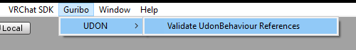
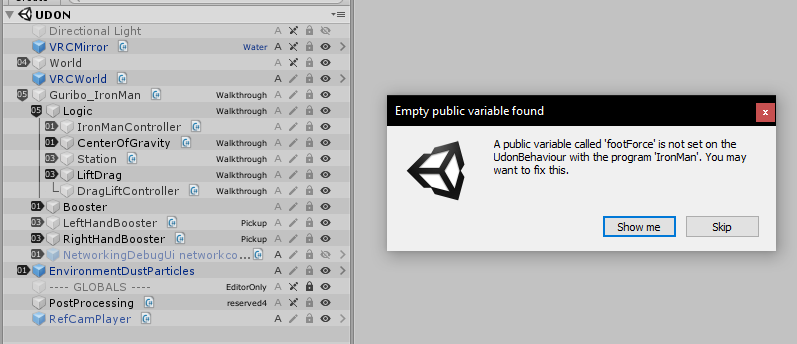
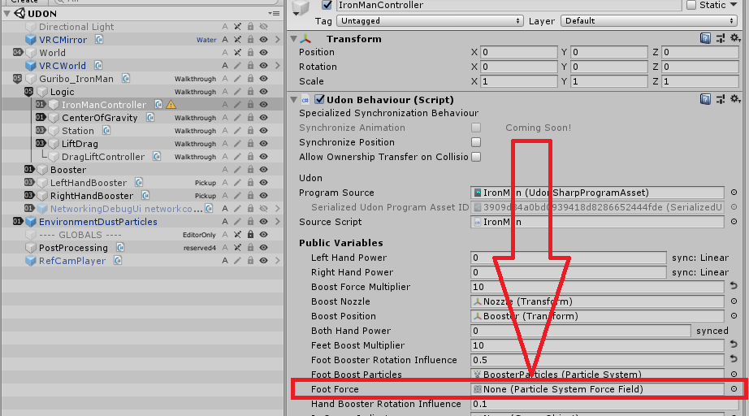
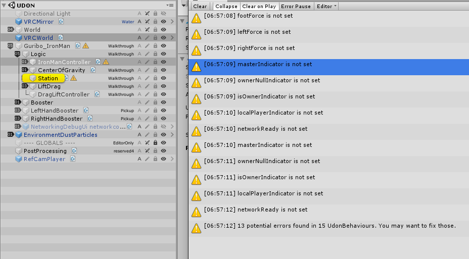
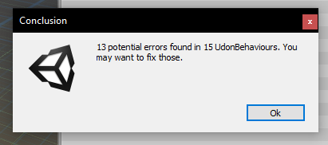
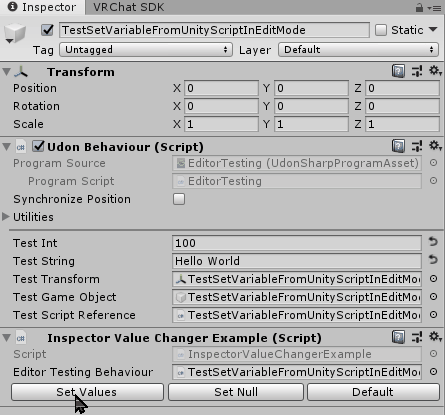

# Udon Utilitiess

Scripts that make developing with UDON for VRChat safer and more fun :)

# Requirements

 - [UdonSharp](https://github.com/vrchat-community/UdonSharp#requirements) as described by [Merlin](https://github.com/MerlinVR)

## Features

#### Scene Checking
* automatically checks the scene for empty public variables (*null*) and logs to the console (every time assets get saved)
* allows checking manually via menu entry to allow instant navigation to errors

#### Editor Scripting
* UdonBehaviour Extension methods for changing and reading UdonBehaviour variables in Edit mode have been added.

## Usage and Examples

### Scene Checking
Use via menu or silently by saving the scene (Ctrl+s):  


Skip or show errors:  


Locate empty variable by name and allow easy fixing of variable (optionally (¬‿¬) ):  


Warns about potential errors is the console and clicking on the message will alos highlight the affected gameobject in the hierarchy:  


In case all errors get skipped a conclusion will be presented:  


### Editor Scripting
> [Example script](Scripts/Examples/InspectorValueChangerExample.cs)
````c#
public UdonBehaviour editorTestingBehaviour;

public void TrySetVariables()
{
    editorTestingBehaviour.SetInspectorVariable("testInt", 100);
    editorTestingBehaviour.SetInspectorVariable("testString", "Hello World");
    editorTestingBehaviour.SetInspectorVariable("testTransform", gameObject.transform);
    editorTestingBehaviour.SetInspectorVariable("testGameObject", gameObject);
    editorTestingBehaviour.SetInspectorVariable("testScriptReference", editorTestingBehaviour);
}

...
````

  
*Example scene and scripts are included*

